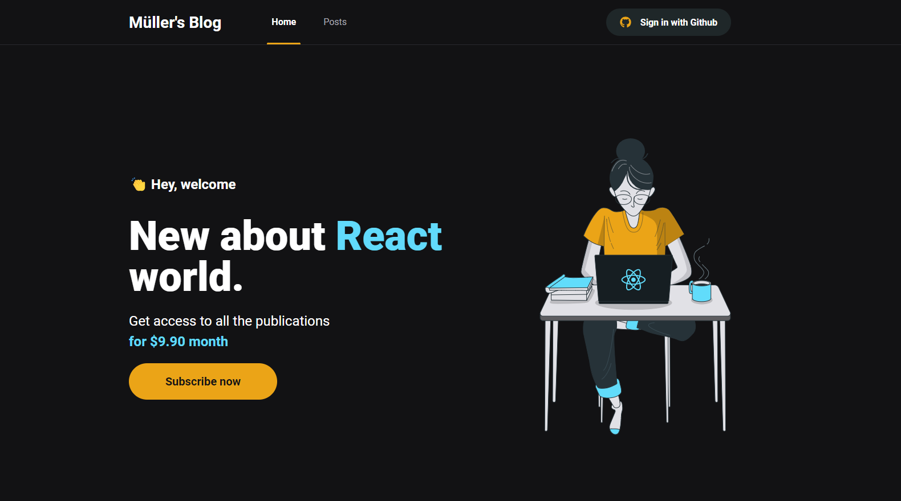
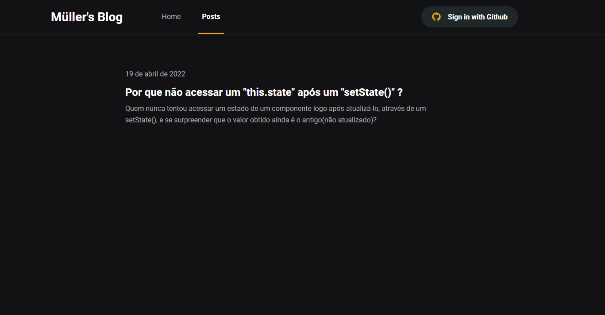

# DEV NEWS

Dev News is a platform of content consumer. 
Through of the Prismic CMS, it consumer its content using api call by axios library.
There is an authenticate process using GitHub api.
It's need to be authenticated to be able to access the full content of posts.
The credentials of authentication are stored in Fauna DB.
Also there is a signature pay system using the Stripe API.


## Screenshots





## Demo

https://muller-devnews.vercel.app/


## Run Locally


Clone the project

```bash
  git clone https://github.com/MullerEsposito/dev-news
```

Go to the project directory

```bash
  cd dev-news
```

Install dependencies

```bash
  npm install
```

Start the server

```bash
  npm run dev
```


## Environment Variables

To run this project, you will need to add the following environment variables to your .env file

OAuth GitHub:
`GITHUB_ID`
`GITHUB_SECRET`

Prismic:
`PRISMIC_ACCESS_TOKEN`
`PRISMIC_ENDPOINT`

Stripe:
`STRIPE_API_KEY`
`STRIPE_WEBHOOK_SECRET`
`STRIPE_SUCCESS_URL`
`STRIPE_CANCEL_URL`

Fauna DB:
`FAUNA_KEY`

## Running Tests

To run tests, run the following command

```bash
  npm run test
```


## 🛠 Skills
SASS, Typescript, NextJS, FaunaDB, Prismic, Stripe, Jest.


## 🚀 About Me
I'm a full stack developer specialized on stack ReactJS/NodeJS with Typescript.


## 🔗 Links
[](https://www.linkedin.com/in/mulleresposito)

